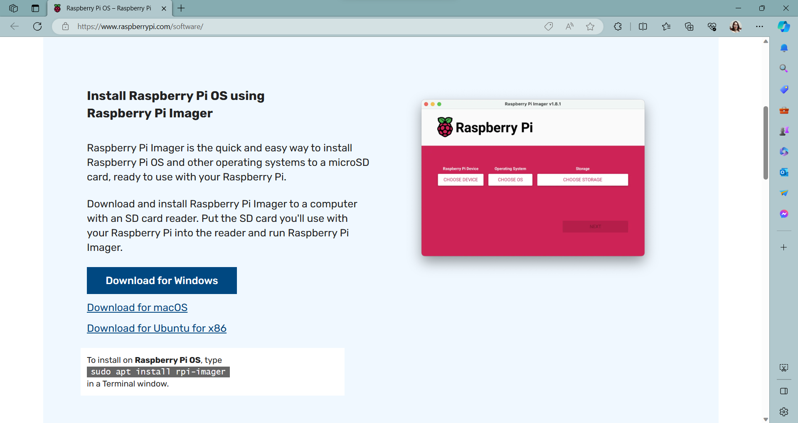
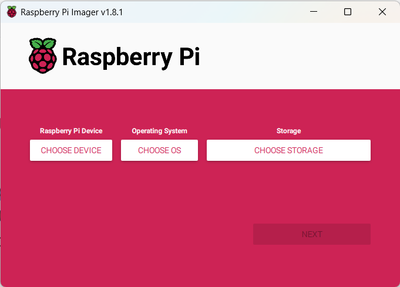
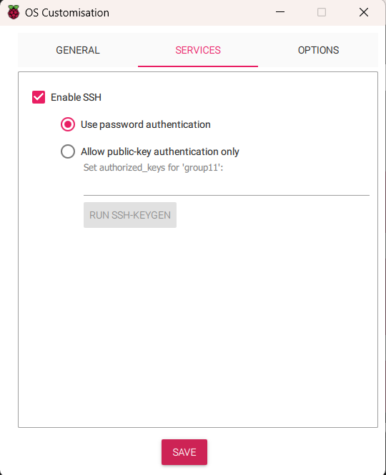
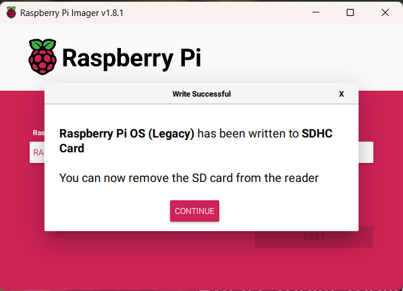

   
>### FINAL PROJECT IN INFORMATION ASSURANCE AND SECURITY
>Mirandilla, Johnlery | Morata, Marri Grace | Nobleza, Uriel Miguel | Pizzaro, Jesrel
# RASPBERRY PI INSTALLATION GUIDE

1. Prepare and Install Headless Raspbian OS in Raspberry Pi
   1. Insert a micro SD card that is 8GB or larger into your computer.
   
   2. Visit the [official Raspberry Pi website](https://www.raspberrypi.com/software/) then download, install, and run Raspberry Pi Imager.

       
   
   3. Choose which device, OS, and storage you are going to use.

      

      Upon clicking **CHOOSE DEVICE/OS/STORAGE**, a menu should appear. The picture below is an example.

      
   
   4. When done making your selection, proceed by clicking **NEXT**.

      
      
   6. Click Edit Settings from the pop-up.

      

   7. Fill in all the fields on the General tab.

      
      
   9. On the Services tab, toggle **Enable SSH** to on and select **Use password authentication."**

      

   10. Click **YES** to apply OS customization settings.

       
       
   11. Click **YES** to confirm that you want to your microSD card and wait until the installation is done.

       
       
       
       
   13. Once OS is downloaded and written in your SD card, click **CONTINUE** then reomove your SD Card from your computer.

       
   
2. Connecting to Raspberry Pi via SSH using the terminal
3. Deploying LAMP (Linux Apache MySQL PHP) Stack in raspberry Pi
4. Enabling and controlling Rapberry Pi using VNC

