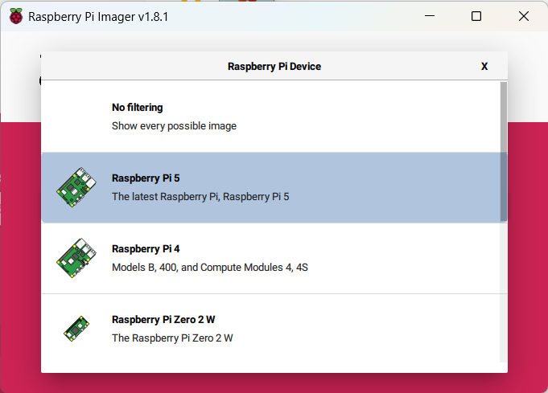

### FINAL PROJECT IN INFORMATION ASSURANCE AND SECURITY
# RASPBERRY PI INSTALLATION GUIDE
### by BSCS 3B Group 1
Mirandilla, Johnlery | Morata, Marri Grace | Nobleza, Uriel Miguel | Pizzaro, Jesrel

1. Prepare and Install Headless Raspbian OS in Raspberry Pi
   1. Insert a micro SD card that is 8GB or larger into your computer.

       
   
   2. Visit the [official Raspberry Pi website](https://www.raspberrypi.com/software/) then download, install, and run Raspberry Pi Imager.

       
   
   3. Choose which device, OS, and storage you are going to use.

      

   Upon clicking **_CHOOSE DEVICE/OS/STORAGE_**, a menu should appear. The picture below is an example.

   4. When done making your selection, proceed by clicking _next_.

   5. Click Edit Settings from the pop-up.

   6. Fill in all the fields on the General tab.

   7. On the Services tab, toggle enable **_SSH_** to on and select **_Use password authentication."_**
   
   
2. Connecting to Raspberry Pi via SSH using the terminal
3. Deploying LAMP (Linux Apache MySQL PHP) Stack in raspberry Pi
4. Enabling and controlling Rapberry Pi using VNC

